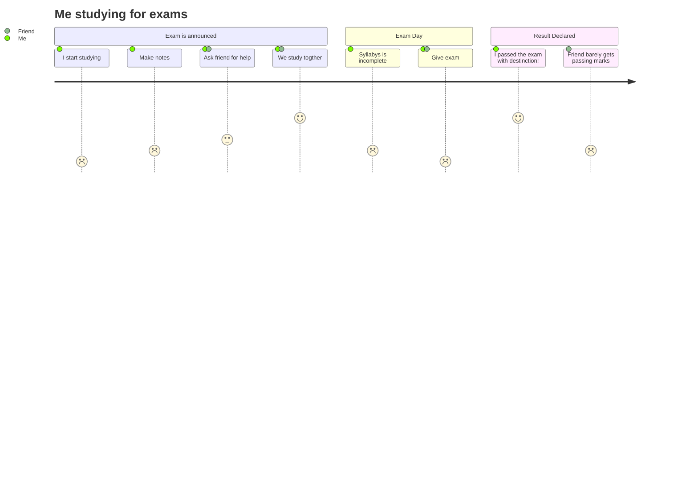

# Universal Turing Machine

This proyect is an implementation of the universal turing machine in python.

To use it, a tape must be provided. This tape must have the initial state of the tape with the '*' character as the starting point. The '-' character must mark the begining of the initial register and the subsequent registers must be separated by the '/' character. Finally the tape must end with the '#' character.

This is an example of a tape which replaces the first character with a 0, moves to the first 0 and replaces it with a 1.

'*10110-001/0010100/0110110/0101010/#'

## Execution

To execute the machine there are two options:

`python3 ./main <tape>`

`python3 ./main -f <file>`

In the first option the tape is provided directly while in the second option the tape is stored in a file.

## Theory

The UTM is a state machine that can compute any computable sequence. It has a tape of ones and zeros that it will change according to some instructions.
The initial state of the tape is represented by the first section of the input and the pointer is where the '*' character is. Following the tape, we have the state which contains the number of the state (00) and the character pointed at (1). Finally whe have the instructions which are composed by the state it referes to (001, state 0 pointing to 1) the state it passes to (010, state 1 pointing to 0) and the direction it will move to (0 -> right, 1 -> left). With this simple setup Alan Turing devised a machine that would execute any computable sequence.

The example shown above would represent the following states:

